## Details

The `Converter Framework` in `markitdown` establishes a robust and extensible architecture for handling diverse document conversion operations. It defines the core interfaces, manages the lifecycle of converters, and provides the necessary context for successful transformations into Markdown.

### DocumentConverter [Expand](./DocumentConverter.md)
This is the foundational abstract base class that defines the contract for all document converters. It mandates two essential methods: `accepts()`, which determines if a converter can process a given input stream based on its metadata, and `convert()`, which performs the actual transformation of the input stream into Markdown, returning a `DocumentConverterResult`. This abstract interface ensures consistency and extensibility across all concrete converter implementations.

**Related Classes/Methods**:

- `DocumentConverter` (1:1)
- `DocumentConverter:accepts` (1:1)
- `DocumentConverter:convert` (1:1)

### MarkItDown [Expand](./MarkItDown.md)
Serving as the central orchestrator of the `markitdown` library, `MarkItDown` is responsible for discovering, registering, and intelligently selecting the most appropriate `DocumentConverter` for a given input. It handles various input sources (local files, URIs, HTTP responses, binary streams) and prepares the `StreamInfo` object that provides context to the converters. It then delegates the actual conversion task to the chosen converter, managing the overall conversion workflow.

**Related Classes/Methods**:

- `MarkItDown` (1:1)

### converters
This Python package acts as the primary repository for all concrete implementations of the `DocumentConverter` abstract base class. Each module within this directory (e.g., `_docx_converter.py`, `_html_converter.py`) encapsulates the specific logic required to convert a particular document type into Markdown. This modular organization facilitates the easy addition of new document type support, promoting extensibility and maintainability.

**Related Classes/Methods**:

- `markitdown.converters` (1:1)

### HtmlConverter [Expand](./HtmlConverter.md)
A concrete implementation of `DocumentConverter` specifically designed to transform HTML content into Markdown. This converter is highly versatile and frequently serves as a crucial intermediate step for other converters (e.g., `DocxConverter`, `EpubConverter`) that first convert their input to HTML before generating the final Markdown output. It handles parsing HTML, removing unwanted elements like scripts and styles, and converting the remaining content to Markdown.

**Related Classes/Methods**:

- `HtmlConverter` (1:1)

### DocxConverter [Expand](./DocxConverter.md)
A concrete implementation of `DocumentConverter` tailored for converting Microsoft Word (.docx) files into Markdown. It leverages external libraries (like `mammoth`) to convert DOCX to HTML, and then utilizes an internal instance of `HtmlConverter` to perform the final HTML-to-Markdown transformation. It also incorporates pre-processing steps for specific DOCX elements, such as mathematical equations, ensuring accurate representation in the output.

**Related Classes/Methods**:

- `DocxConverter` (1:1)

### _StreamInfo
This data structure (defined within the `_stream_info` module) encapsulates comprehensive metadata about the input stream being processed. This includes vital information such as MIME type, file extension, character set, filename, local path, and URL. It provides a standardized and rich context that the `MarkItDown` orchestrator passes to `DocumentConverter` instances, enabling converters to make informed decisions about whether they can `accept()` a stream and how to `convert()` it effectively.

**Related Classes/Methods**:

- `_StreamInfo` (1:1)

### [FAQ](https://github.com/CodeBoarding/GeneratedOnBoardings/tree/main?tab=readme-ov-file#faq)