## Details

The `Converter Management` subsystem is crucial for `markitdown`'s ability to handle diverse document formats. It establishes a flexible and extensible architecture for converting various input streams into Markdown.

### DocumentConverter [Expand](./DocumentConverter.md)
This is the abstract base class that defines the common interface for all document converters. It mandates the `accepts` and `convert` methods, ensuring that any new converter adheres to a consistent contract. This promotes polymorphism and allows the `MarkItDown Core Engine` to interact with different converters uniformly.

**Related Classes/Methods**: _None_

### DocumentConverterResult
This class encapsulates the output of a document conversion. It primarily holds the generated Markdown string and can optionally include a document title. This standardized result format ensures consistency across all converter implementations.

**Related Classes/Methods**: _None_

### StreamInfo
This data class provides essential metadata about the input stream, such as its MIME type, file extension, character set, and origin (local path or URL). This information is vital for converters to determine if they can process a given stream and to correctly interpret its content.

**Related Classes/Methods**: _None_

### HtmlConverter [Expand](./HtmlConverter.md)
A concrete implementation of `DocumentConverter` specifically designed to convert HTML content into Markdown. It handles the initial parsing of HTML, cleans up irrelevant tags (like scripts and styles), and then delegates the core HTML-to-Markdown transformation to `_CustomMarkdownify`.

**Related Classes/Methods**:

- `_CustomMarkdownify` (0:0)

### _CustomMarkdownify [Expand](./_CustomMarkdownify.md)
This utility class extends an external Markdown converter (`markdownify.MarkdownConverter`) to provide specialized HTML-to-Markdown conversion logic. It customizes aspects like heading styles, removes JavaScript hyperlinks, and handles data URIs in images, ensuring a clean and accurate Markdown output.

**Related Classes/Methods**:

### [FAQ](https://github.com/CodeBoarding/GeneratedOnBoardings/tree/main?tab=readme-ov-file#faq)