## Details

The `DocxConverter` component is central to the DOCX to Markdown conversion process. It orchestrates the pre-processing of DOCX content, leverages an external library (`mammoth`) for DOCX to HTML conversion, and then delegates the final HTML to Markdown conversion to the `HtmlConverter`.

### DocxConverter [Expand](./DocxConverter.md)
This is the primary component responsible for orchestrating the conversion of DOCX files to Markdown. It handles initial checks for external dependencies (like `mammoth`), pre-processes the DOCX content (e.g., for mathematical equations), and then delegates the core DOCX-to-HTML conversion to an external library (`mammoth`). Finally, it passes the resulting HTML to the `HtmlConverter` for the final HTML-to-Markdown conversion.

**Related Classes/Methods**:

- `DocxPreProcessor:pre_process_docx` (0:0)
- `HtmlConverter` (0:0)
- `MissingDependencyException` (0:0)

### HtmlConverter [Expand](./HtmlConverter.md)
A versatile component designed to convert HTML content into Markdown. It is leveraged by `DocxConverter` to process the intermediate HTML generated from the DOCX file. It internally uses the `_CustomMarkdownify` utility for the actual conversion process.

**Related Classes/Methods**:

- `_CustomMarkdownify` (0:0)

### DocxPreProcessor
This component focuses on preparing the DOCX file for conversion. Its main task is to unzip the DOCX, identify and transform specific XML parts (e.g., converting mathematical equations from OMML to LaTeX using `oMath2Latex`), and then re-package the DOCX. This ensures that complex elements are correctly handled before the main conversion.

**Related Classes/Methods**:

- `oMath2Latex` (0:0)

### MissingDependencyException
This exception class is part of the dependency handling mechanism. While not a "component" in the sense of performing actions, its presence and usage pattern within `DocxConverter` highlight a critical aspect of the system: ensuring that all necessary external libraries are available before attempting a conversion.

**Related Classes/Methods**: _None_

### oMath2Latex
This component is responsible for converting Office Math Markup Language (OMML) elements found within DOCX XML to their LaTeX equivalents. It is a crucial part of the pre-processing step, ensuring mathematical equations are correctly rendered in the final Markdown output. It relies on `latex_dict` for character and symbol mappings.

**Related Classes/Methods**:

- `latex_dict` (0:0)

### latex_dict
This module acts as a dictionary or lookup table for converting various Unicode characters and symbols found in OMML to their corresponding LaTeX representations. It supports a wide range of mathematical symbols, accents, and Greek letters.

**Related Classes/Methods**: _None_

### _CustomMarkdownify [Expand](./_CustomMarkdownify.md)
This is a customized version of the `markdownify.MarkdownConverter`. It extends the base functionality to handle specific requirements for Markdown conversion, such as altering heading styles, removing JavaScript hyperlinks, truncating large data URI images, and ensuring proper URI escaping to avoid conflicts with Markdown syntax.

**Related Classes/Methods**:

- `markdownify.MarkdownConverter` (0:0)

### [FAQ](https://github.com/CodeBoarding/GeneratedOnBoardings/tree/main?tab=readme-ov-file#faq)