## Details

This subsystem, the `DOCX Pre-processing Utility`, is designed to prepare DOCX files for conversion by extracting and transforming specific XML content, particularly converting Office Math Markup Language (OMML) equations into LaTeX format.

### DocxPreProcessor
This component, primarily embodied by the `pre_process_docx` function, orchestrates the initial pre-processing of a DOCX file. It handles the unzipping of the DOCX, identifies and extracts specific XML files (`word/document.xml`, `word/footnotes.xml`, `word/endnotes.xml`), and applies necessary transformations to their content before re-zipping the file. Its primary function is to prepare the document's XML for subsequent conversions, specifically by invoking the math pre-processing logic.

**Related Classes/Methods**:

- `pre_process_docx` (0:0)

### OMMLtoLatexConverter
This component, implemented as the `oMath2Latex` class, is responsible for converting OMML (Office Math Markup Language) elements found within the DOCX XML into their corresponding LaTeX representations. It employs a dynamic dispatch mechanism, utilizing numerous `do_` methods that are invoked based on the specific OMML tag encountered. It relies on a base class for XML traversal and utility functions for common operations.

**Related Classes/Methods**:

- `oMath2Latex` (0:0)

### TagProcessorBase
This component, likely represented by the `Tag2Method` class (which `oMath2Latex` inherits from), provides a foundational, generic framework for processing XML elements based on their tags. It defines abstract methods that enable subclasses to define tag-specific processing logic and recursively traverse the XML tree, ensuring a structured approach to XML parsing and transformation.

**Related Classes/Methods**:

- `Tag2Method` (0:0)

### MathConversionUtilities
This component encapsulates a collection of helper functions, such as `get_val` and `escape_latex`, that provide common utilities essential for the mathematical conversion process. These functions ensure safe data retrieval from XML elements and proper LaTeX string sanitization, supporting the `OMMLtoLatexConverter` by handling common, repetitive tasks.

**Related Classes/Methods**:

- `get_val` (0:0)
- `escape_latex` (0:0)

### LatexMappingData
This component is dedicated to providing the necessary LaTeX mappings for various OMML elements. It contains dictionaries and constants (e.g., `T`, `CHR_DEFAULT`, `POS_DEFAULT`, `F_DEFAULT`, `FUNC`) that define the translation rules from OMML tags and attributes to their corresponding LaTeX syntax, serving as a crucial data source for the `OMMLtoLatexConverter`.

**Related Classes/Methods**:

- `T` (0:0)
- `CHR_DEFAULT` (0:0)
- `POS_DEFAULT` (0:0)
- `F_DEFAULT` (0:0)
- `FUNC` (0:0)

### [FAQ](https://github.com/CodeBoarding/GeneratedOnBoardings/tree/main?tab=readme-ov-file#faq)