## Details

Here's an overview of the fundamental components within the `markitdown` project, focusing on their structure, flow, and purpose. These components were chosen because they represent the core orchestration, the abstract interface for extensibility, key concrete implementations, and essential utility functions that support the conversion process.

### MarkItDown [Expand](./MarkItDown.md)
The central orchestrator of the `markitdown` library. It is responsible for managing and selecting the appropriate `DocumentConverter` implementation based on the input type (file, URL, etc.). It delegates the actual conversion tasks and handles the loading of both built-in and plugin converters, making it the entry point for most conversion operations.

**Related Classes/Methods**:

- `markitdown.src.markitdown._markitdown` (0:0)

### DocumentConverter [Expand](./DocumentConverter.md)
This is the abstract base class that defines the standardized interface for all document converters within the `markitdown` system. It mandates the implementation of two crucial methods: `accepts()` (to quickly determine if a converter can handle a given input stream) and `convert()` (to perform the actual conversion to Markdown). This abstraction allows for easy integration of new document types.

**Related Classes/Methods**:

- `markitdown.src.markitdown._base_converter` (0:0)

### DocxConverter [Expand](./DocxConverter.md)
A concrete implementation of `DocumentConverter` specifically designed to convert Microsoft Word (.docx) files into Markdown. It handles the complexities of parsing DOCX XML, extracting content, and transforming it into a Markdown-compatible format, often leveraging other converters or pre-processing steps.

**Related Classes/Methods**:

- `markitdown.src.markitdown.converters._docx_converter` (0:0)

### HtmlConverter [Expand](./HtmlConverter.md)
A concrete implementation of `DocumentConverter` responsible for transforming HTML content into Markdown. This converter is versatile, used directly for HTML inputs, and also serves as an internal step for other converters (like `DocxConverter`) that might first convert their content to HTML.

**Related Classes/Methods**:

- `markitdown.src.markitdown.converters._html_converter` (0:0)

### pre_process_docx [Expand](./pre_process_docx.md)
A utility module specifically designed for pre-processing DOCX files before their main conversion to Markdown. Its primary role is to identify and convert Office Math Markup Language (OMML) equations embedded within the DOCX XML structure into a LaTeX format, ensuring mathematical expressions are correctly rendered in the final Markdown output.

**Related Classes/Methods**:

- `markitdown.src.markitdown.converter_utils.docx.pre_process` (0:0)

### oMath2Latex
A specialized utility function that handles the conversion of Office Math Markup Language (OMML) equations into LaTeX format. It's a crucial part of the DOCX pre-processing pipeline, ensuring mathematical content is accurately translated for Markdown rendering.

**Related Classes/Methods**:

- `markitdown.src.markitdown.converter_utils.docx.math.omml` (0:0)

### _uri_utils
This module provides a collection of utility functions for parsing and handling various Uniform Resource Identifier (URI) schemes, including `file://` URIs for local files and `data:` URIs for embedded data. It's essential for resolving input paths and extracting data from diverse URI formats, enabling the `MarkItDown` engine to access content from different sources.

**Related Classes/Methods**:

- `markitdown.src.markitdown._uri_utils` (0:0)

### _stream_info
This module provides data structures and utilities for managing metadata about input streams. This information, such as mimetype, file extension, and character set, is critical for `DocumentConverter` implementations to determine if they can `accept()` a given input and how to process it during conversion.

**Related Classes/Methods**:

- `markitdown.src.markitdown._stream_info` (0:0)

### _markdownify
This component (likely a module or a set of functions) encapsulates the core logic for converting HTML content into Markdown. It handles the transformation of HTML tags, attributes, and structures into their Markdown equivalents, ensuring proper formatting and readability.

**Related Classes/Methods**:

- `markitdown.src.markitdown.converters._markdownify` (0:0)

### latex_dict
This component likely contains a comprehensive mapping or dictionary that defines the translation rules from Office Math Markup Language (OMML) elements to their corresponding LaTeX representations. It serves as a lookup table for the `oMath2Latex` utility during the conversion of mathematical equations.

**Related Classes/Methods**:

- `markitdown.src.markitdown.converter_utils.docx.math.latex_dict` (0:0)

### [FAQ](https://github.com/CodeBoarding/GeneratedOnBoardings/tree/main?tab=readme-ov-file#faq)