## Details

Overview of the MarkItDown document conversion subsystem components and their relationships.

### Base Converter Interface [Expand](./Base_Converter_Interface.md)
This abstract component defines the fundamental interface (`accepts` and `convert` methods) that all document converters must implement. It ensures a consistent contract for how different content types are processed into Markdown, enabling the `MarkItDown Core` to interact with various converters uniformly.

**Related Classes/Methods**:

- `BaseConverterInterface` (1:1)

### HTML to Markdown Converter [Expand](./HTML_to_Markdown_Converter.md)
This component (`HtmlConverter`) is responsible for converting HTML content into Markdown. It acts as a crucial intermediate step for many other converters that first transform their input into HTML before final Markdown conversion. It relies on the `Custom Markdownify Utility` for the actual conversion logic.

**Related Classes/Methods**:

- `HtmlConverter` (1:1)

### Custom Markdownify Utility [Expand](./Custom_Markdownify_Utility.md)
This utility (`_CustomMarkdownify`) extends a third-party Markdown conversion library (`markdownify`) to provide tailored HTML-to-Markdown conversion. It includes custom rules for handling headings, sanitizing hyperlinks (removing JavaScript links), and managing image data URIs, ensuring high-quality Markdown output that aligns with `markitdown`'s specific requirements.

**Related Classes/Methods**:

- `_CustomMarkdownify` (1:1)

### DOCX Converter [Expand](./DOCX_Converter.md)
This component (`DocxConverter`) specializes in converting Microsoft Word (DOCX) files to Markdown. It orchestrates the pre-processing of DOCX content (e.g., handling mathematical equations) and then uses an external library (`mammoth`) to convert the DOCX to HTML, finally delegating the HTML-to-Markdown conversion to the `HTML to Markdown Converter`.

**Related Classes/Methods**:

- `DocxConverter` (1:1)

### DOCX Pre-processing Utility [Expand](./DOCX_Pre_processing_Utility.md)
This utility (`pre_process_docx`, `oMath2Latex`) is dedicated to preparing DOCX files before their main conversion. Its primary function is to extract and transform specific XML parts within the DOCX, such as converting Office Math Markup Language (OMML) equations into LaTeX format, ensuring better rendering in Markdown.

**Related Classes/Methods**:

- `pre_process_docx` (1:1)
- `oMath2Latex` (1:1)

### YouTube Content Converter [Expand](./YouTube_Content_Converter.md)
This component (`YouTubeConverter`) is designed to convert YouTube video pages into Markdown. It parses the HTML of a YouTube page to extract key metadata like title, description, views, and runtime. Additionally, it attempts to fetch and embed the video transcript, providing a comprehensive Markdown representation of the YouTube content.

**Related Classes/Methods**:

- `YouTubeConverter` (1:1)

### RSS/Atom Feed Converter [Expand](./RSS_Atom_Feed_Converter.md)
This component (`RssConverter`) processes RSS and Atom feed XML structures, extracting information such as feed titles, descriptions, and individual entry/item details (titles, summaries, content, publication dates). It then formats this information into Markdown, often using the `Custom Markdownify Utility` for any embedded HTML content found within the feed entries.

**Related Classes/Methods**:

- `RssConverter` (1:1)

### [FAQ](https://github.com/CodeBoarding/GeneratedOnBoardings/tree/main?tab=readme-ov-file#faq)