## Details

This subsystem is designed to robustly convert Microsoft Word (DOCX) documents into Markdown format, handling various complexities like mathematical equations and preserving structural elements. The core components work in a pipeline to achieve this conversion.

### DocxConverter [Expand](./DocxConverter.md)
The primary entry point for DOCX to Markdown conversion. It orchestrates the entire process, from dependency validation to delegating pre-processing and final HTML-to-Markdown conversion. It ensures that necessary external libraries are present and handles the overall flow.

**Related Classes/Methods**:

- `DocxPreProcessor` (1:1)
- `HtmlConverter` (1:1)
- `MissingDependencyException` (1:1)

### DocxPreProcessor
This component is responsible for preparing the DOCX content before it's converted to HTML. Its main task is to extract and transform specific XML parts within the DOCX, particularly converting Office Math Markup Language (OMML) equations into LaTeX format, which is crucial for accurate rendering in Markdown.

**Related Classes/Methods**:

- `OMMLToLaTeXConverter` (1:1)

### OMMLToLaTeXConverter
A specialized utility within the `DocxPreProcessor` that specifically handles the conversion of OMML (Office Math Markup Language) found in DOCX files into LaTeX syntax. It uses a predefined dictionary (`latex_dict.py`) for mapping OMML elements to their LaTeX equivalents.

**Related Classes/Methods**: _None_

### HtmlConverter [Expand](./HtmlConverter.md)
A versatile converter that takes HTML content as input and transforms it into Markdown. In the context of `DocxConverter`, it receives the HTML output generated from the pre-processed DOCX content (via `mammoth`) and performs the final conversion to Markdown.

**Related Classes/Methods**: _None_

### MissingDependencyException
A custom exception class used to signal when a required external library or dependency is not installed. It provides clear error messages, guiding the user on how to resolve missing dependencies.

**Related Classes/Methods**: _None_

### [FAQ](https://github.com/CodeBoarding/GeneratedOnBoardings/tree/main?tab=readme-ov-file#faq)