## Details

The `HTML to Markdown Converter` subsystem is designed to transform HTML content into Markdown. It's a crucial intermediary for other converters that first convert their input to HTML before the final Markdown conversion.

### HtmlConverter [Expand](./HtmlConverter.md)
This component is the primary orchestrator for converting HTML input (from a file stream or a string) into Markdown. It handles parsing the HTML, cleaning it by removing script and style tags, and then delegates the core conversion logic to `_CustomMarkdownify`. It also manages the input stream information and produces the final `DocumentConverterResult`.

**Related Classes/Methods**:

- `HtmlConverter` (0:0)

### _CustomMarkdownify [Expand](./_CustomMarkdownify.md)
This component is a specialized Markdown converter that takes a BeautifulSoup object (representing parsed HTML) and transforms it into a Markdown string. It's the core workhorse for the actual HTML-to-Markdown conversion, implementing specific logic for converting HTML elements into their Markdown equivalents, including custom handling for headings, links, and images.

**Related Classes/Methods**:

- `_CustomMarkdownify` (0:0)

### DocumentConverterResult
This data structure encapsulates the outcome of any document conversion within the `markitdown` project. For the `HtmlConverter`, it specifically holds the generated Markdown string and the document title.

**Related Classes/Methods**:

- `DocumentConverterResult` (0:0)

### StreamInfo
This component provides essential metadata about the input stream, such as the MIME type, file extension, character set, and URL/local path. This information is crucial for `HtmlConverter` to correctly parse the HTML content and ensure proper encoding handling.

**Related Classes/Methods**:

- `StreamInfo` (0:0)

### [FAQ](https://github.com/CodeBoarding/GeneratedOnBoardings/tree/main?tab=readme-ov-file#faq)