## Details

This subsystem is centered around the conversion of HTML content into Markdown, serving as a critical intermediate step for various other document converters within the `markitdown` project. The chosen components are fundamental because they encapsulate the core responsibilities of parsing, cleaning, and transforming HTML into a structured Markdown output.

### HtmlConverter [Expand](./HtmlConverter.md)
This component is the primary orchestrator for converting HTML input (either from a file stream or a string) into Markdown. It handles the initial parsing of HTML using `BeautifulSoup`, cleans the content by removing script and style tags, and then delegates the core conversion logic to `_CustomMarkdownify`. It also defines the types of HTML content it `accepts` based on mimetype and file extension.

**Related Classes/Methods**: _None_

### _CustomMarkdownify [Expand](./_CustomMarkdownify.md)
This component is a specialized Markdown converter that extends `markdownify.MarkdownConverter`. It takes a `BeautifulSoup` object (representing parsed HTML) and transforms it into a Markdown string. It encapsulates intricate logic for the actual HTML-to-Markdown conversion, including custom handling for headings (ensuring newlines), filtering JavaScript hyperlinks, escaping URIs to prevent conflicts with Markdown syntax, and truncating images with large data URI sources.

**Related Classes/Methods**: _None_

### DocumentConverterResult
This is a data structure (likely a dataclass or similar) that encapsulates the standardized result of any document conversion within the `markitdown` project. It primarily holds the generated Markdown string and can include other metadata like the document title extracted during the conversion process.

**Related Classes/Methods**: _None_

### StreamInfo
This component provides essential metadata about an input stream, such as the character set, mimetype, file extension, and URL. This information is crucial for `HtmlConverter` to correctly parse and interpret the content of the input stream, especially for HTML, to avoid encoding issues and ensure proper content handling during conversion.

**Related Classes/Methods**: _None_

### BeautifulSoup
An external, third-party library used by `HtmlConverter` for parsing HTML and XML documents. It transforms raw HTML into a navigable parse tree, which is then consumed and processed by `_CustomMarkdownify` to generate Markdown.

**Related Classes/Methods**: _None_

### [FAQ](https://github.com/CodeBoarding/GeneratedOnBoardings/tree/main?tab=readme-ov-file#faq)