## Details

This component acts as the initial entry point for all data within the `markitdown` system, preparing it for conversion into Markdown. It intelligently analyzes incoming data streams and routes them to the appropriate conversion logic, ensuring a standardized and efficient conversion process.

### Markitdown
This is the core orchestrator of the `markitdown` system. It serves as the primary interface for users to initiate conversions from various input types (files, streams, URIs). Its main responsibilities include identifying the input type, gathering stream information, selecting the appropriate converter, and managing the overall conversion workflow. It acts as the central hub, delegating specific tasks to other components.

**Related Classes/Methods**:

- `markitdown.Markitdown` (0:0)

### StreamInfo
This data class encapsulates metadata about an input stream, such as its MIME type, file extension, character set, filename, local path, and URL. It's crucial for the `Markitdown` class to accurately identify the nature of the input and for individual converters to process the stream correctly.

**Related Classes/Methods**:

- `markitdown.StreamInfo` (0:0)

### _BaseConverter
This abstract class defines the standardized interface (`accepts` and `convert` methods) that all concrete document converters must implement. It establishes the contract for how any input type should be processed and converted into Markdown, forming the foundational element of the "Converter Framework."

**Related Classes/Methods**:

- `markitdown._BaseConverter` (0:0)

### UriUtils
This utility class is responsible for handling operations related to Uniform Resource Identifiers (URIs). Given that `Markitdown` can accept URI inputs, `UriUtils` likely provides functionalities for parsing, validating, and potentially fetching content from URIs, preparing them for stream processing.

**Related Classes/Methods**:

- `markitdown.UriUtils` (0:0)

### converters Package
This package serves as the repository for all concrete implementations of the `_BaseConverter` abstract class. Each module within this package (e.g., `_html_converter.py`, `_docx_converter.py`) contains a specialized converter designed to transform a specific document type (HTML, DOCX, PDF, etc.) into Markdown. This package collectively forms the operational backbone of the "Converter Framework."

**Related Classes/Methods**:

- `markitdown.converters` (0:0)

### HtmlConverter [Expand](./HtmlConverter.md)
A concrete implementation of `_BaseConverter` specifically designed to convert HTML content into Markdown. It demonstrates how individual converters utilize `StreamInfo` to determine if they can handle a given input and then perform the actual conversion, often by parsing the HTML and applying Markdown formatting rules.

**Related Classes/Methods**:

- `markitdown.converters.HtmlConverter` (0:0)

### DocxConverter [Expand](./DocxConverter.md)
A concrete implementation of `_BaseConverter` that handles the conversion of DOCX files to Markdown. Notably, it inherits from `HtmlConverter`, indicating a multi-stage conversion process where DOCX content is first transformed into an intermediate HTML representation before being converted to Markdown.

**Related Classes/Methods**:

- `markitdown.converters.DocxConverter` (0:0)

### [FAQ](https://github.com/CodeBoarding/GeneratedOnBoardings/tree/main?tab=readme-ov-file#faq)