## Details

The `MarkItDown Core Engine` subsystem is the central processing unit of the `markitdown` library, orchestrating the conversion of various document types into Markdown. It intelligently identifies input types, manages a registry of document converters, and dispatches conversion tasks to the appropriate handlers. This subsystem is designed for extensibility, allowing for both built-in and plugin-based converters.

### MarkItDown Core Engine [Expand](./MarkItDown_Core_Engine.md)
This is the primary orchestrator, responsible for managing the conversion process from input to Markdown. It maintains a registry of converters, determines the appropriate converter for a given input, and executes the conversion. It also handles plugin loading for extended functionality.

**Related Classes/Methods**:

- `markitdown.MarkItDown` (0:0)

### Base Converter
Defines the abstract interface (`DocumentConverter`) that all concrete document converters must implement. It specifies the `accepts()` method for input type determination and the `convert()` method for performing the actual conversion, ensuring a standardized contract for all converters.

**Related Classes/Methods**:

- `markitdown._base_converter.DocumentConverter` (41:104)

### Document Converter Result
A data structure (`DocumentConverterResult`) used to encapsulate the outcome of a document conversion. It primarily holds the converted Markdown string and an optional document title.

**Related Classes/Methods**:

- `markitdown._base_converter.DocumentConverterResult` (4:38)

### Stream Information
This component (`StreamInfo`) is a data class that stores and provides crucial metadata about the input stream, such as its MIME type, file extension, character set, filename, and source URL. This information is vital for the `MarkItDown` engine to select the correct converter.

**Related Classes/Methods**:

- `markitdown._stream_info.StreamInfo` (5:31)

### URI Utilities
This module provides utility functions (`file_uri_to_path`, `parse_data_uri`) for handling and parsing various Uniform Resource Identifiers (URIs), including `file://` and `data:` schemes. It ensures that the `MarkItDown` engine can correctly interpret and access content from diverse URI sources.

**Related Classes/Methods**:

- `markitdown._uri_utils` (0:0)

### HTML Converter
A concrete implementation of `DocumentConverter` specifically designed to transform HTML input (from file streams or strings) into Markdown. It parses HTML using BeautifulSoup, performs cleaning (e.g., removing script/style tags), and delegates the core Markdown conversion.

**Related Classes/Methods**:

- `markitdown.converters._html_converter.HtmlConverter` (19:89)

### Custom Markdownify
This component (`_CustomMarkdownify`) is a specialized Markdown converter that takes a BeautifulSoup object (representing parsed HTML) and transforms it into a Markdown string. It extends an external library (`markdownify`) and applies custom rules for formatting headings, handling links, and managing image data URIs.

**Related Classes/Methods**:

- `markitdown.converters._markdownify._CustomMarkdownify` (7:110)

### [FAQ](https://github.com/CodeBoarding/GeneratedOnBoardings/tree/main?tab=readme-ov-file#faq)