## Details

This subsystem is designed to efficiently parse and convert RSS and Atom feed XML structures into a standardized Markdown format. It handles the complexities of different feed standards, extracts relevant information, and ensures proper formatting of embedded HTML content.

### RssConverter [Expand](./RssConverter.md)
This is the primary entry point for the RSS/Atom feed conversion process. It is responsible for accepting the input file stream, performing initial XML validation, detecting the specific feed type (RSS or Atom), and then delegating the parsing to the appropriate specialized methods. It orchestrates the entire flow from raw feed data to the final Markdown output.

**Related Classes/Methods**:

- `RssConverter` (1:1)

### Feed Type Detector
This component, embodied by `_check_xml` and `_feed_type` methods within `RssConverter`, is crucial for validating the input as a well-formed XML document and accurately identifying whether it adheres to the RSS or Atom feed standard. `_check_xml` performs the initial XML parsing and error handling, while `_feed_type` inspects the root XML element (`<rss>` or `<feed>`) to determine the feed's specific type.

**Related Classes/Methods**:

- `RssConverter:_check_xml` (1:1)
- `RssConverter:_feed_type` (1:1)

### Atom Feed Parser
Implemented as the `_parse_atom_type` method of `RssConverter`, this component specializes in parsing the unique structure of Atom feeds. It navigates the XML document to extract data from standard Atom tags (e.g., `title`, `subtitle`, `entry`, `summary`, `content`, `published`) and formats this information into Markdown according to Atom's conventions.

**Related Classes/Methods**:

- `RssConverter:_parse_atom_type` (1:1)

### RSS Feed Parser
This component, represented by the `_parse_rss_type` method of `RssConverter`, is dedicated to parsing RSS feed structures. It extracts data from RSS-specific tags (e.g., `rss`, `channel`, `item`, `title`, `description`, `pubDate`, `content:encoded`) and formats them into Markdown, adhering to RSS conventions.

**Related Classes/Methods**:

- `RssConverter:_parse_rss_type` (1:1)

### XML Data Extractor
This utility component, the `_get_data_by_tag_name` method within `RssConverter`, is a shared helper function used by both the Atom and RSS Feed Parsers. Its purpose is to safely retrieve the text content of the first child element with a specified tag name from a given XML element. It includes error handling to ensure robustness when tags might be missing or empty.

**Related Classes/Methods**:

- `RssConverter:_get_data_by_tag_name` (1:1)

### Content Markdownifier
This component, the `_parse_content` method of `RssConverter`, is responsible for converting potentially HTML-formatted content (commonly found in RSS/Atom descriptions or content fields) into clean Markdown. It achieves this by instantiating and utilizing the `Custom Markdownify Utility`, ensuring that embedded HTML is correctly transformed.

**Related Classes/Methods**:

- `RssConverter:_parse_content` (1:1)

### Custom Markdownify Utility [Expand](./Custom_Markdownify_Utility.md)
This is a distinct internal utility class, `_CustomMarkdownify`, which extends the `markdownify.MarkdownConverter`. It provides specialized HTML-to-Markdown conversion rules, including custom handling for headings, removal of JavaScript hyperlinks, truncation of large data URIs in images, and proper escaping of URIs to prevent conflicts with Markdown syntax.

**Related Classes/Methods**:

- `_CustomMarkdownify` (1:1)

### DocumentConverterResult
This is a data structure (`DocumentConverterResult`) used to encapsulate the output of the conversion process. It typically holds the generated Markdown text and the extracted title of the document, providing a standardized and consistent return type for the conversion operation.

**Related Classes/Methods**:

- `DocumentConverterResult` (1:1)

### [FAQ](https://github.com/CodeBoarding/GeneratedOnBoardings/tree/main?tab=readme-ov-file#faq)