## Details

The `RssConverter` subsystem is designed to efficiently parse and convert RSS and Atom feed XML content into a standardized Markdown format. Its core purpose is to ingest various feed types, extract relevant information, and present it in a human-readable Markdown output, handling embedded HTML content gracefully.

### RssConverter [Expand](./RssConverter.md)
The primary class responsible for orchestrating the entire RSS/Atom feed conversion process. It acts as the entry point, determining the feed type and delegating parsing to specific internal methods. It inherits from `DocumentConverter`, providing a standardized interface for document conversion.

**Related Classes/Methods**:

- `RssConverter` (0:0)

### Feed Type Detector
Internal methods (`_check_xml`, `_feed_type`) within `RssConverter` that validate if an input stream is a well-formed XML document and subsequently identify if it's an RSS or Atom feed. This involves initial XML parsing using `minidom` and inspecting root elements.

**Related Classes/Methods**:

- `RssConverter:_check_xml` (0:0)
- `RssConverter:_feed_type` (0:0)

### Atom Feed Parser
An internal method (`_parse_atom_type`) of `RssConverter` specifically designed to parse Atom feed structures. It extracts data from Atom-specific tags (e.g., `title`, `subtitle`, `entry`, `summary`, `content`) and formats them into Markdown.

**Related Classes/Methods**:

- `RssConverter:_parse_atom_type` (0:0)

### RSS Feed Parser
An internal method (`_parse_rss_type`) of `RssConverter` specializing in parsing RSS feed structures. It extracts data from RSS-specific tags (e.g., `rss`, `channel`, `item`, `title`, `description`, `pubDate`, `content:encoded`) and formats them into Markdown.

**Related Classes/Methods**:

- `RssConverter:_parse_rss_type` (0:0)

### XML Data Extraction Utility
A helper method (`_get_data_by_tag_name`) within `RssConverter` used by both Atom and RSS Feed Parsers to safely retrieve text content from XML elements based on a given tag name, handling cases where tags might be missing or empty.

**Related Classes/Methods**:

- `RssConverter:_get_data_by_tag_name` (0:0)

### Content Markdownifier
An internal method (`_parse_content`) of `RssConverter` responsible for converting HTML-formatted content (often found in feed descriptions or content fields) into clean Markdown. It leverages the `_CustomMarkdownify` component for this transformation.

**Related Classes/Methods**:

- `RssConverter:_parse_content` (0:0)

### Custom Markdownify
A distinct class (`_CustomMarkdownify`) that extends `markdownify.MarkdownConverter` to perform the actual conversion of HTML (represented as a BeautifulSoup object) into Markdown. It includes custom rules for headings, link handling (e.g., removing JavaScript links, escaping URIs), and image processing (e.g., truncating data URIs).

**Related Classes/Methods**:

- `_CustomMarkdownify` (0:0)

### DocumentConverterResult
A data structure (`DocumentConverterResult`) used to encapsulate the output of the conversion process. It typically holds the generated Markdown text and the extracted document title, providing a standardized return type for all converters.

**Related Classes/Methods**:

- `DocumentConverterResult` (0:0)

### [FAQ](https://github.com/CodeBoarding/GeneratedOnBoardings/tree/main?tab=readme-ov-file#faq)