## Details

Component Overview: YouTube Content Converter. This section provides a detailed overview of the `YouTube Content Converter` subsystem, outlining its core components, their responsibilities, and their interactions. The analysis focuses on the `YouTubeConverter` class and its associated helper methods, as well as its interaction with external libraries and internal data structures.

### YouTubeConverter
This is the primary component of the subsystem, responsible for orchestrating the entire process of converting a YouTube video page into a Markdown document. It extends `DocumentConverter` and implements the core logic for parsing HTML, extracting metadata (title, description, views, runtime), and integrating video transcripts. It handles URL validation, HTML parsing using `BeautifulSoup`, and the structured assembly of the final Markdown output.

**Related Classes/Methods**:

- `YouTubeConverter:_findKey` (0:0)
- `YouTubeConverter:_get` (0:0)
- `YouTubeConverter:_retry_operation` (0:0)
- `YouTubeTranscriptApi` (0:0)
- `DocumentConverter` (0:0)
- `BeautifulSoup` (0:0)

### _findKey
A private utility method within `YouTubeConverter` designed for recursively searching and extracting specific key-value pairs from deeply nested dictionary and list structures. It is crucial for parsing the `ytInitialData` JavaScript object embedded in YouTube's HTML, which contains a significant portion of the video's metadata, including the detailed description.

**Related Classes/Methods**: _None_

### _get
A private utility method within `YouTubeConverter` that provides a robust way to retrieve metadata. It attempts to fetch the first non-empty value associated with a list of potential keys from a given metadata dictionary. This method enhances the reliability of metadata extraction by accommodating variations in key names or providing fallback options.

**Related Classes/Methods**: _None_

### _retry_operation
A private helper method within `YouTubeConverter` that implements a retry mechanism for potentially flaky operations. It allows a given function or operation to be retried multiple times with a specified delay between attempts. This is particularly vital for improving the resilience of external API calls, such as fetching transcripts from `YouTubeTranscriptApi`, against transient network issues or rate limits.

**Related Classes/Methods**: _None_

### YouTubeTranscriptApi
An external Python library that provides programmatic access to YouTube video transcripts (captions). The `YouTubeConverter` component utilizes this library to fetch and embed the full transcript into the generated Markdown, significantly enriching the converted content.

**Related Classes/Methods**: _None_

### DocumentConverterResult
A standardized data structure (class) defined in the base converter module. It serves as the consistent output format for all document conversion processes within `markitdown`, encapsulating the converted Markdown string and the document's title. `YouTubeConverter` produces an instance of this class upon successful conversion.

**Related Classes/Methods**: _None_

### [FAQ](https://github.com/CodeBoarding/GeneratedOnBoardings/tree/main?tab=readme-ov-file#faq)